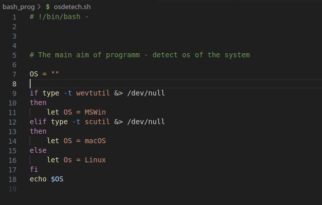

# Inf_sec

<h1>Introduction to cyber security</h1>
<h2>By Pol Tronkon's "Bash and cyber security"</h2>

<h4>Introduction to bash scripts</h4>

<h6>Structer of average script</h6>

<h6>List of commands and structers in prog</h6>

<ul>
    <li><code></code></li>
    <li><code></code></li>
</ul>

<h5>How to work with varibles</h5>

